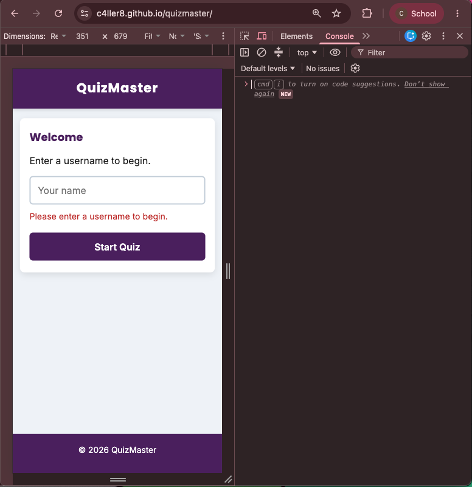
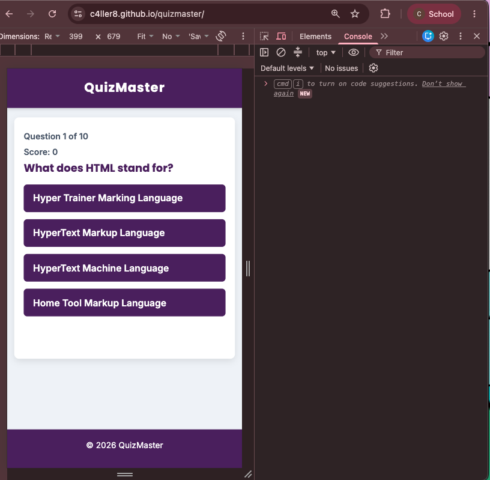
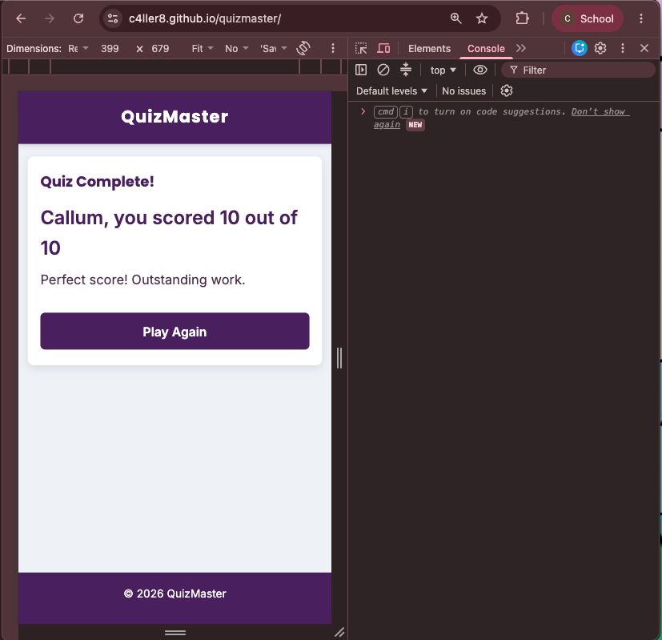
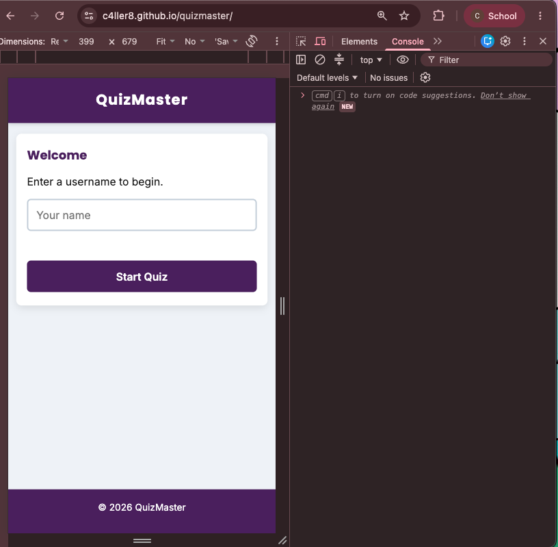
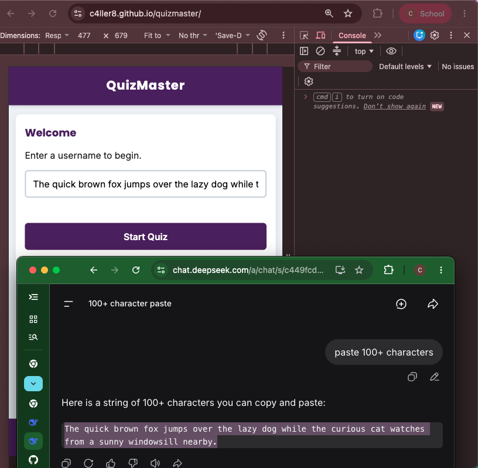
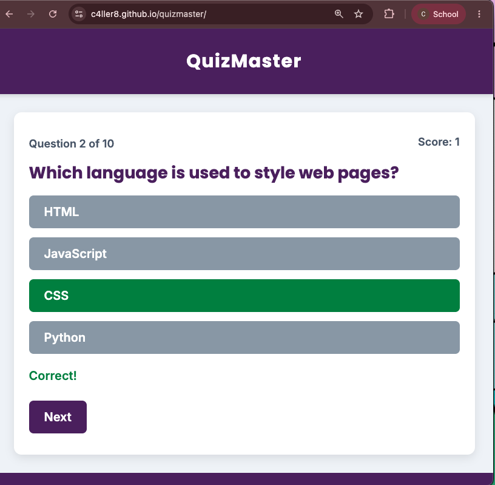
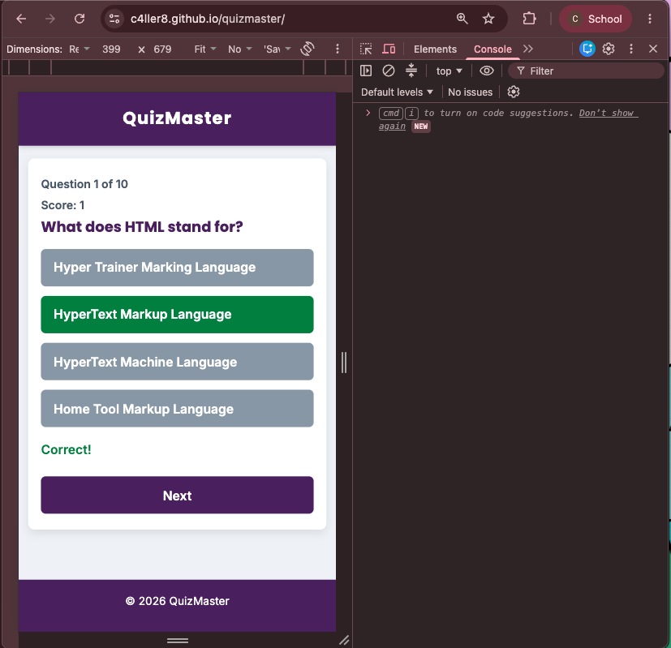
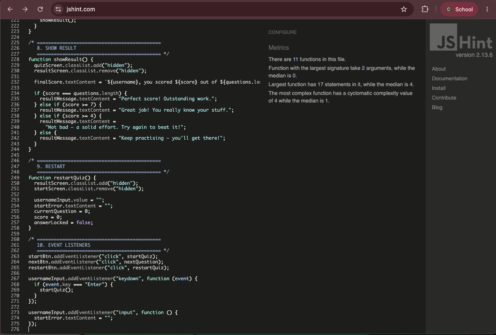
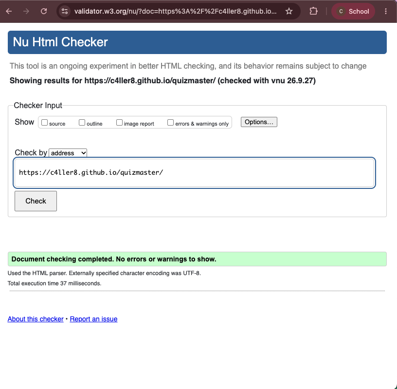
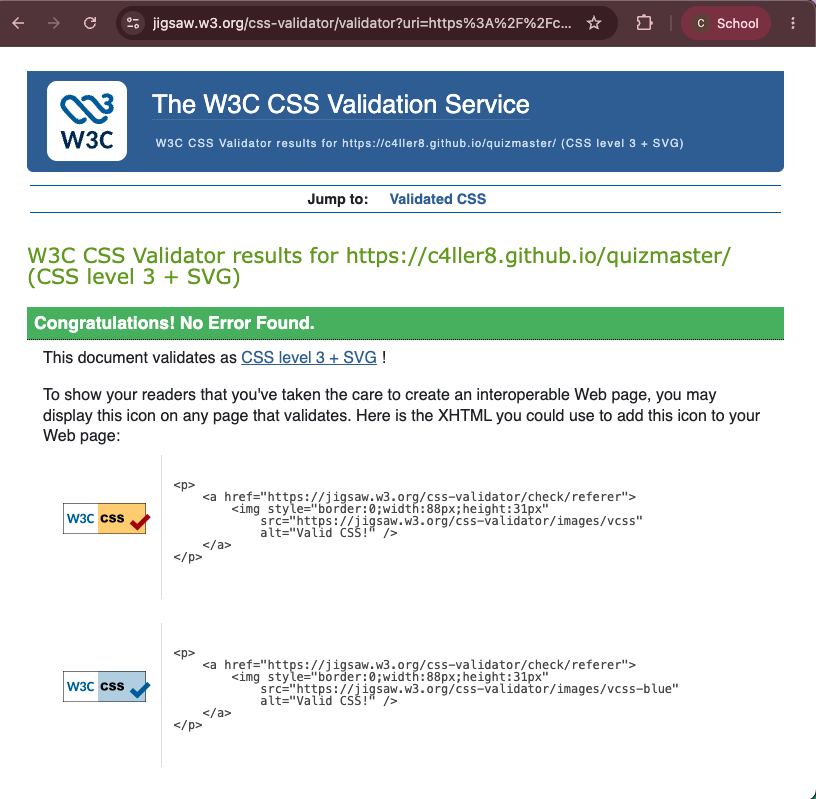

# QuizMaster

QuizMaster is a 10-question general knowledge quiz built with vanilla JavaScript.

## Purpose

QuizMaster is an interactive front-end web app where users enter a username and answer 10 multiple-choice questions one at a time. It gives instant feedback, tracks the score, and shows a final result with a restart option. Responsive, accessible, and built with HTML, CSS, and JavaScript.

## Value to Users

- Quick, replayable quiz that needs no sign-up — just a username.
- Instant feedback after every answer, so users learn as they play.
- Live score tracking keeps users engaged throughout.
- Fully responsive — works on mobile, tablet, and desktop.
- Accessible design: high-contrast colours, clear headings, keyboard-friendly buttons.

## Features

### Username Entry

Users enter a username before starting. Empty or overly long usernames are rejected with a clear inline error, which clears as soon as the user types again. This ensures every session is personalised without requiring an account.

### Quiz Screen

Questions appear one at a time with four answer options. Clicking an answer immediately locks the choices, highlights the correct answer in green and any wrong selection in red, and updates the live score. A progress indicator shows the current question number, and a Next button advances the quiz. This instant feedback loop is the core of the app's interactivity.

### Results Screen

After the tenth question, users see their final score along with a personalised message based on performance. A "Play Again" button resets the quiz and returns to the username screen. This gives users a clear end state and an easy way to replay.

## How to Play

1. Enter a username and click **Start Quiz**.
2. Answer each question by clicking one of the four options.
3. Read the feedback, then click **Next** to continue.
4. After question 10, view your score and click **Play Again** to restart.

## Testing

- **HTML:** W3C validator — 0 errors, 0 warnings
- **CSS:** Jigsaw validator — 0 errors
- **JavaScript:** JSHint with `esversion: 6, browser: true` — 0 warnings
- **Manual tests:** empty username, 100+ character username, rapid clicking, mid-quiz reload (returns to start screen), restart — all handled gracefully with no console errors

### Evidence

**Start screen — clean state**

**Empty username validation**

Users cannot start the quiz without entering a username. The inline error appears immediately and clears as soon as the user types.

**Long username handled gracefully**

A 100+ character username was pasted to test the input field's limits. The field accepts the text without breaking the layout, and the quiz can still be started.

**Rapid clicking — no double scoring**

Clicking an answer button multiple times quickly locks the answer after the first click. The score increments once only, and no console errors appear.

**Question 1 — unanswered state**

The first question appears with four answer options. Progress shows "Question 1 of 10" and score is 0.

**Correct answer feedback**

Clicking the correct answer highlights it in green, locks the other buttons, displays "Correct!", and increments the score. A Next button appears to continue.

**Results screen**

After the final question, the user sees their score with a personalised message and a Play Again button.

**JSHint — JavaScript validation**

JavaScript passes JSHint with `esversion: 6, browser: true` configured. Zero warnings.

**W3C HTML validator — 0 errors, 0 warnings**

Live site validated via the Nu Html Checker.

**W3C CSS validator (Jigsaw) — 0 errors**

CSS validated via the Jigsaw service. Recognised as CSS Level 3 + SVG.

## Deployment

Deployed via GitHub Pages.

**Steps:**

1. Push the project to a public GitHub repository.
2. Go to **Settings → Pages**.
3. Under **Source**, select **Deploy from a branch** → **main** → **/ (root)**.
4. Click **Save**. The site publishes at `https://c4ller8.github.io/quizmaster/`.

## Attributions

- Icon from [favicon.io](https://favicon.io/emoji-favicons/joystick)
- Fonts: [Poppins](https://fonts.google.com/specimen/Poppins) and [Inter](https://fonts.google.com/specimen/Inter) via Google Fonts (SIL Open Font License).

## Technologies Used

- HTML5
- CSS3
- JavaScript (ES6)
